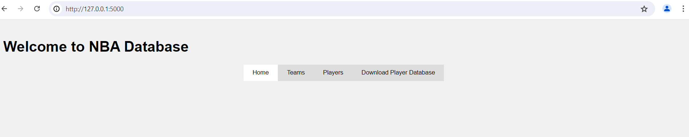

# NBA Database
NBA Database- A Flask-based Web Application
## Table of Contents

1. [Introduction](#introduction)
2. [Key Features](#key-features)
3. [Technologies Used](#technologies-used)
4. [Project Structure](#project-structure)
5. [Installation & Setup](#installation--setup)
6. [Usage & Screenshots](#usage--screenshots)
7. [Database Structure](#database-structure)
8. [API Endpoints](#api-endpoints)

## Introduction

NBA Database is a mini framework that fetches information from different endpoints of nba_api, storing information in a database and visualizing these information in different sections of webpage.

## Key Features

- Real-time data fetching from NBA API
- Efficient data storage using SQLAlchemy (Object Relational Mapping-ORM)
- Interactive data visualizations with Plotly
- Responsive front-end design using HTML, CSS, and JavaScript

## Technologies Used

Python, Flask, SQLAlchemy, Plotly, NBA API, HTML, CSS, JavaScript, SQLite. (You can browse requirements.txt for details)

## Project Structure

- Models: SQL Alchemy Database Models - Between lines of 235 and 295 in app.py
- Views: HTML files in templates folder
- Controllers: Flask routes - Between lines of 102-232 in app.py
- CLI Commands: Custom Flask CLI commands for database operations and data fetching - Between lines of 27-100 in app.py

## Installation & Setup

After cloning the repository, setting up virtual environment and satisfying the requirements (requirements.txt), you should run flask CLI commands in your terminal to create then update the database (Database will be automatically created in your project folder directory)

After opening the terminal in your IDE, you should apply:

- `flask db_create` for creating the database
- `flask db_drop` for dropping the database
- `flask db_seed_teams` for seeding the database with teams
- `flask db_seed_players` for seeding the database with players
- `flask db_extend_player_info` for updating the players table with country, jersey, weight, height and position information
- `flask db_add_career_stats` for updating the players table with career stats.
- After flask CLI commands, you can run the app.py file and experience all the functionality which is explained in details in usage (screenshots of application in action) by going to http://127.0.0.1:5000 address in your internet browser

***I separated flask CLI commands for seeding the players table on purpose. So you can arbitrarily add the desired information.

Also you may want to extend columns of the current players or teams tables after the initial database creation. In this case, you should update database models in code snippet and then you should create other flask CLI commands for seeding the database.

But between seeding the database and updating database models, you should apply:

- `flask migrate`
- `flask upgrade`

to update the current database. That's why I used flask-migrate package in this project. But you don't need to use these flask CLI commands in final code in order to test out current functionality. If you want to extend current database after creation then you should apply these flask CLI commands.

## Usage & Screenshots

Homepage

Teams Section

Players section. Players are grouped by surnames.

Switching radio button to filter only active players

Search bar is searching for the word both in name and surname

Player details section

Career stats section

You can use “toggle graph” if you want to view some essential stats in graph

Download database section. Functionality to fetch database in both excel, csv or json(API) formats

Json(API)

Excel(.xlsx)

CSV(Pycharm view)

## Database Structure

Database structure and tables in SQLite 

Teams table in SQLite

Players table in SQLite-1

Players table in SQLite-2
## API Endpoints

- nba_api.stats.static/players
- nba_api.stats.static/teams
- nba_api.stats.endpoints/commonplayerinfo*
- nba_api.stats.endpoints/playercareerstats*

*It takes a while fetching information from these endpoints for all players. So I saved as json files (nba_players.json, career_stats_of_all_players.json), added to repository and implemented the code in this way.
